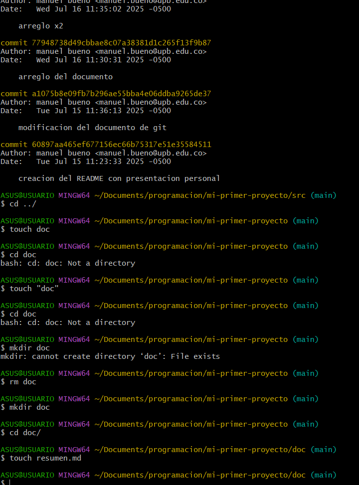

pasos para crear nuevo repo y enlazarlo con el local
# resumen de la clase de github
1) entro a github creando cuenta y todo 
2) en github creo un repositorio 
3) posteriormente pongo el comando git remote add origin https://github.com/tu-usuario/mi-primer-proyecto.git el cual funciona para crear el repositorio y enlazarlo, finalmente para que quede de una manera remota bien creada utilizamos el git push que nos ayuda a subir todos los archivos creados de mi repositorio local 
4) posteriormente creamos un documento y lo editamos para despues crear un backup y subirlo con el commit y despues con el push para que ya quede en la web de github en mi cuenta
